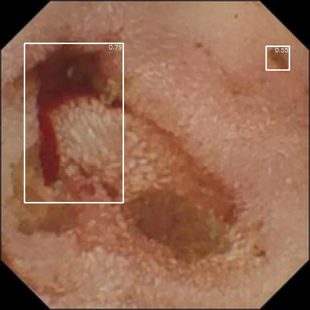

# Auto-WCEBleedGen Challenge Submission

## Table of Achieved Evaluation Metrics

| Dataset    | Metric                                  | Value |
| ---------- | --------------------------------------- | ----- |
| Validation | Classification Accuracy                 | XX%   |
| Validation | Classification Recall                   | XX%   |
| Validation | Classification F1-Score                 | XX%   |
| Validation | Detection Average Precision             | XX%   |
| Validation | Detection Mean Average Prec.            | XX%   |
| Validation | Detection Intersection over Union (IoU) | XX%   |

## Screenshots/Pictures of Best Validation Results

### Image 1

### Image 2

## Repository Structure

- Explain the structure of your repository, including important directories and files.

## YOLOv8 Detection Model

### Model Overview

- Provide an overview of your YOLOv8-based detection model.
- Mention any modifications or enhancements you made to the base YOLOv8 architecture.

## EfficientNet Classification Model

### Model Overview

- Provide an overview of your EfficientDet-based classification model.
- Mention any modifications or enhancements you made to the base EfficientDet architecture.

## How to Run

- Provide instructions for others to replicate your results using your code and models.
- Include any dependencies or libraries needed to run the code.

## Conclusion

- Summarize your approach, results, and the significance of your work in addressing the challenge.

## Acknowledgments

- Acknowledge any datasets, libraries, or resources you used in your work.

## Additional Information

- Include any additional information or notes that may be relevant to your submission.
