# Auto-WCEBleedGen Challenge Submission

## Table of Achieved Evaluation Metrics

| Dataset    | Metric                                  | Value           |
| ---------- | --------------------------------------- | --------------- |
| Validation | Classification Accuracy                 | XX%             |
| Validation | Classification Recall                   | XX%             |
| Validation | Classification F1-Score                 | XX%             |
| Validation | Detection Average Precision             | XX%             |
| Validation | Detection Mean Average Precision        | 76.8% @0.5(iou) |
| Validation | Detection Intersection over Union (IoU) | XX%             |

## Screenshots/Pictures of Best Validation Results

### Image 20 (Validation Dataset)

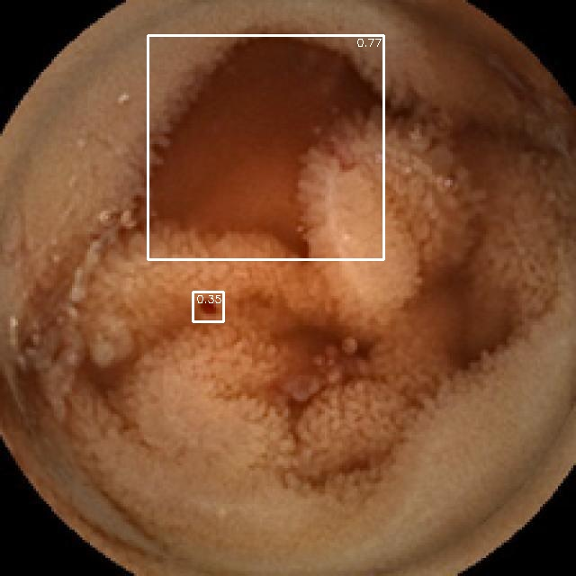

### Image 47 (Validation Dataset)

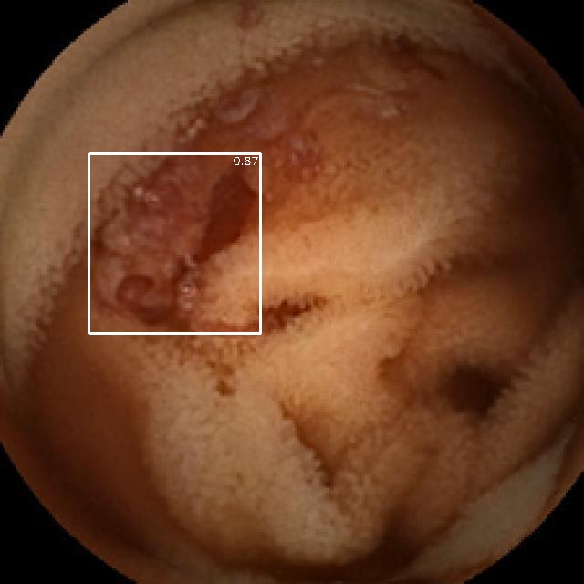

### Image 54 (Validation Dataset)

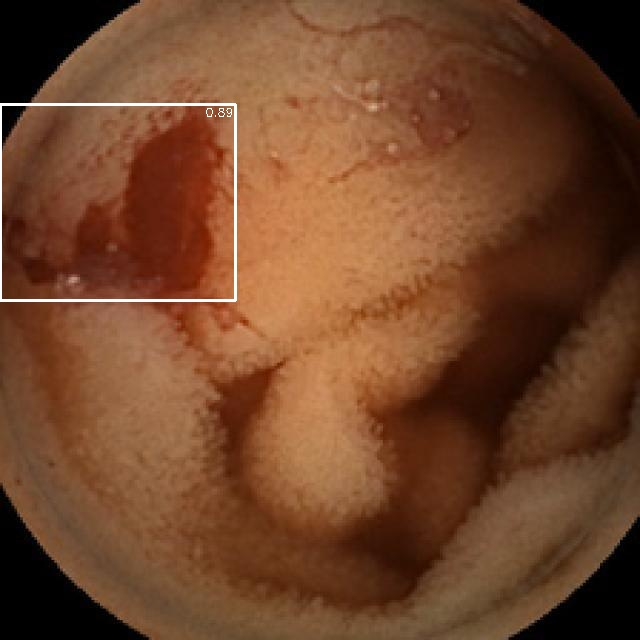

### Image 114 (Validation Dataset)

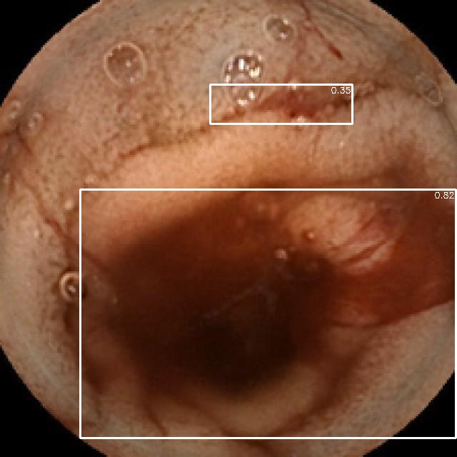

### Image 149 (Validation Dataset)

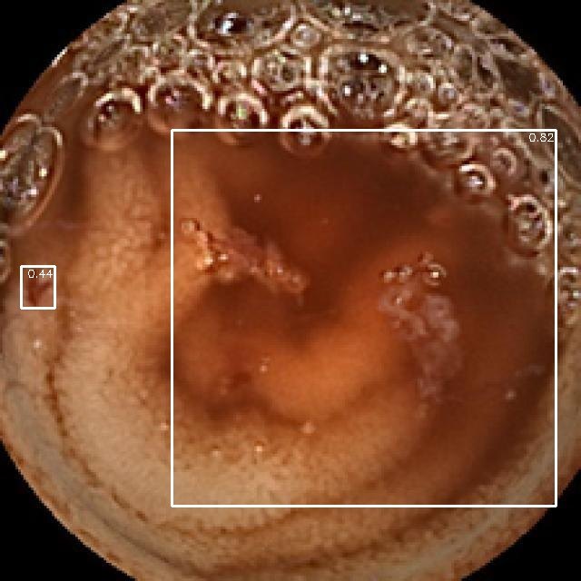

### Image 157 (Validation Dataset)

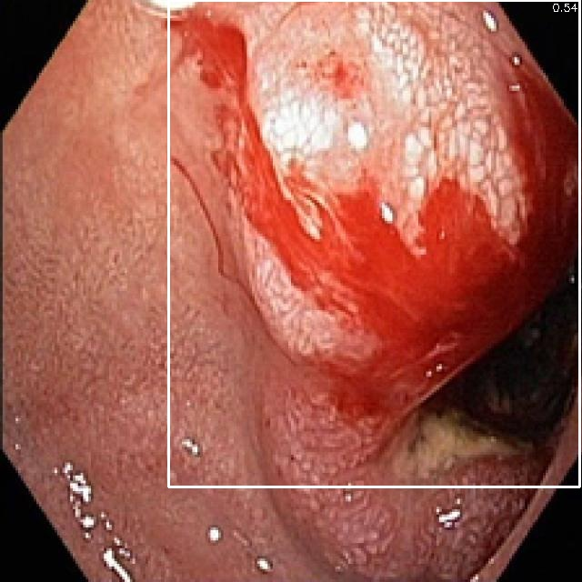

### Image 212 (Validation Dataset)

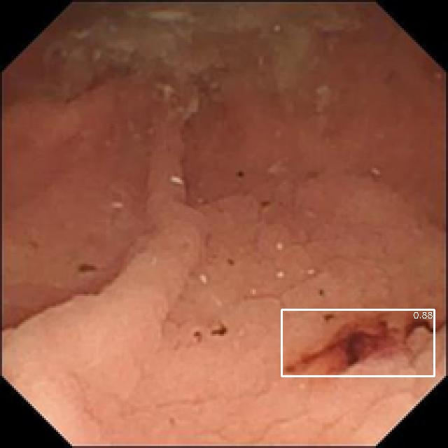

### Image 305 (Validation Dataset)

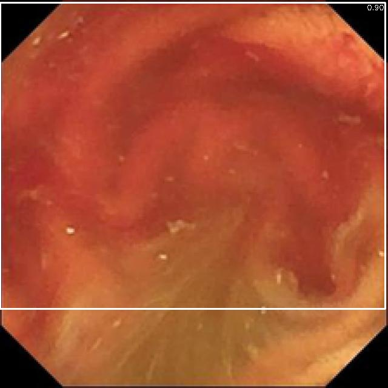

### Image 314 (Validation Dataset)

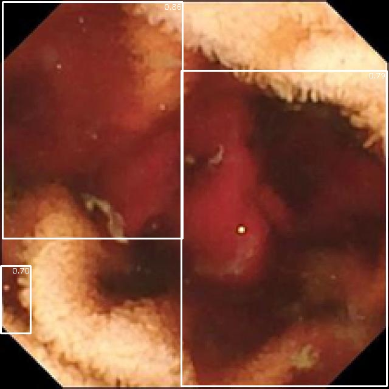

### Image 786 (Validation Dataset)

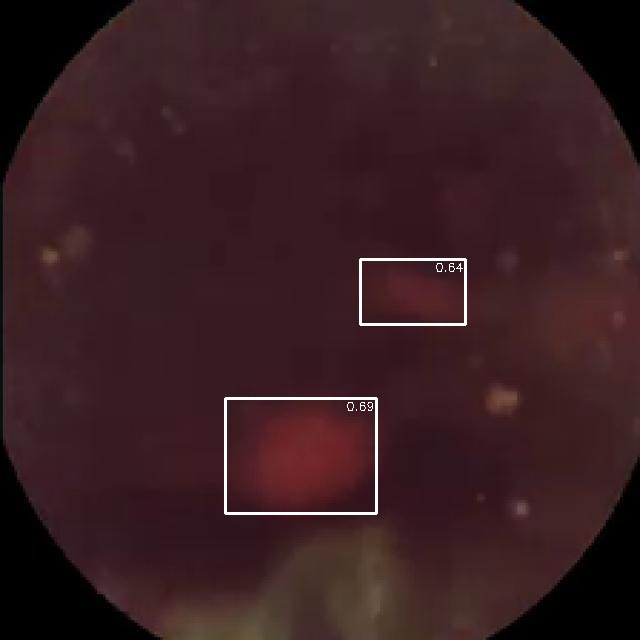

## Interpretability Plots for Best Validation Results

### Interpretability Plot 1

### Interpretability Plot 2

## Screenshots/Pictures of Best Testing Results (Dataset 1)

### A0001.png (Dataset 1)

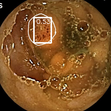

### A0006.png (Dataset 1)

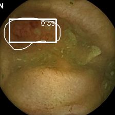

### A0026.png (Dataset 1)

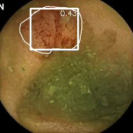

### A0038.png (Dataset 1)

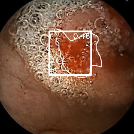

### A0041.png (Dataset 1)

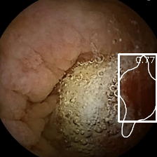

<!-- Repeat the pattern for images 3-5 (Dataset 1) -->

## Screenshots/Pictures of Best Testing Results (Dataset 2)

### A0060.png (Dataset 2)

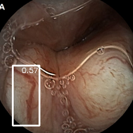

### A00129.png (Dataset 2)

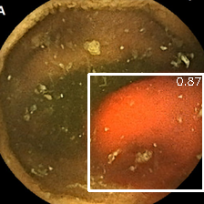

### A0134.png (Dataset 2)

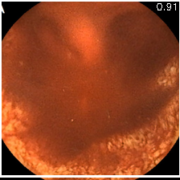

### A0145.png (Dataset 2)

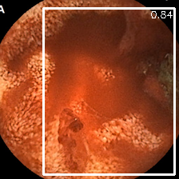

### A0060.png (Dataset 2)

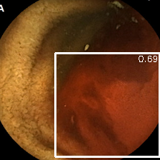

## Interpretability Plots for Best Testing Results (Dataset 1)

### Interpretability Plot 1 (Dataset 1)

### Interpretability Plot 2 (Dataset 1)

<!-- Repeat the pattern for interpretability plots 3-5 (Dataset 1) -->

## Interpretability Plots for Best Testing Results (Dataset 2)

### Interpretability Plot 1 (Dataset 2)

### Interpretability Plot 2 (Dataset 2)

<!-- Repeat the pattern for interpretability plots 3-5 (Dataset 2) -->

## Repository Structure

- Explain the structure of your repository, including important directories and files.

## YOLOv8 Detection Model

### Model Overview

- Provide an overview of your YOLOv8-based detection model.
- Mention any modifications or enhancements you made to the base YOLOv8 architecture.

## EfficientNet Classification Model

### Model Overview

- Provide an overview of your EfficientDet-based classification model.
- Mention any modifications or enhancements you made to the base EfficientDet architecture.

## How to Run

- Provide instructions for others to replicate your results using your code and models.
- Include any dependencies or libraries needed to run the code.

## Conclusion

- Summarize your approach, results, and the significance of your work in addressing the challenge.

## Acknowledgments

- Acknowledge any datasets, libraries, or resources you used in your work.

## Additional Information

- Include any additional information or notes that may be relevant to your submission.
