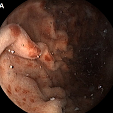
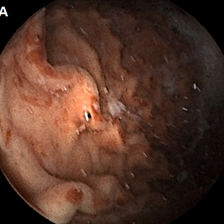
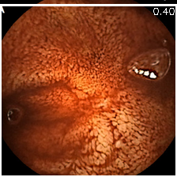

# Auto-WCEBleedGen Challenge Submission

## Challenge Overview

-The aim of the Auto-WCEBleedGen challenge is to provide an opportunity for the development, testing and evaluation of Artificial Intelligence (AI) models for automatic detection and classification of bleeding and non-bleeding frames extracted from Wireless Capsule Endoscopy (WCE) videos.

- MODELS TRAINED AND BUILT: YOLOv8-based detection and EfficientNet-based classification.

## Repository Structure

- Explain the structure of your repository, including important directories and files.

## YOLOv8 Detection Model

### Model Overview

- Provide an overview of your YOLOv8-based detection model.
- Mention any modifications or enhancements you made to the base YOLOv8 architecture.

### Training

- Describe the training process, including the dataset used and any data preprocessing.
- Mention the number of training epochs and key training parameters.

### Evaluation Metrics

- Report the evaluation metrics for the YOLOv8 model, including Average Precision, Mean-Average Precision, and Intersection over Union (IoU).

### Interpretability Plots (Optional)

- Include any interpretability plots, such as CAMs or other visualization techniques, to explain model decisions.

### Sample Results

- Showcase sample images showing the results of your YOLOv8 model, including bleeding region detection and classification.

## EfficientNet Classification Model

### Model Overview

- Provide an overview of your EfficientDet-based classification model.
- Mention any modifications or enhancements you made to the base EfficientDet architecture.

### Training

- Describe the training process, including the dataset used and any data preprocessing.
- Mention the number of training epochs and key training parameters.

### Evaluation Metrics

- Report the evaluation metrics for the EfficientDet model, including Accuracy, Recall, and F1-Score.

### Interpretability Plots (Optional)

- Include any interpretability plots to explain model decisions for classification.

### Sample Results

- Showcase sample images showing the results of your EfficientDet model, including classification.

## Submission Details

- Explain how you have prepared and formatted your submission for both the YOLOv8 and EfficientDet models.
- Describe the contents of the Excel sheets containing image IDs and predictions.

## How to Run

- Provide instructions for others to replicate your results using your code and models.
- Include any dependencies or libraries needed to run the code.

## Conclusion

- Summarize your approach, results, and the significance of your work in addressing the challenge.

## Acknowledgments

- Acknowledge any datasets, libraries, or resources you used in your work.

## Future Work

- Mention any future improvements or extensions you plan for your models.

## Additional Information

- Include any additional information or notes that may be relevant to your submission.
