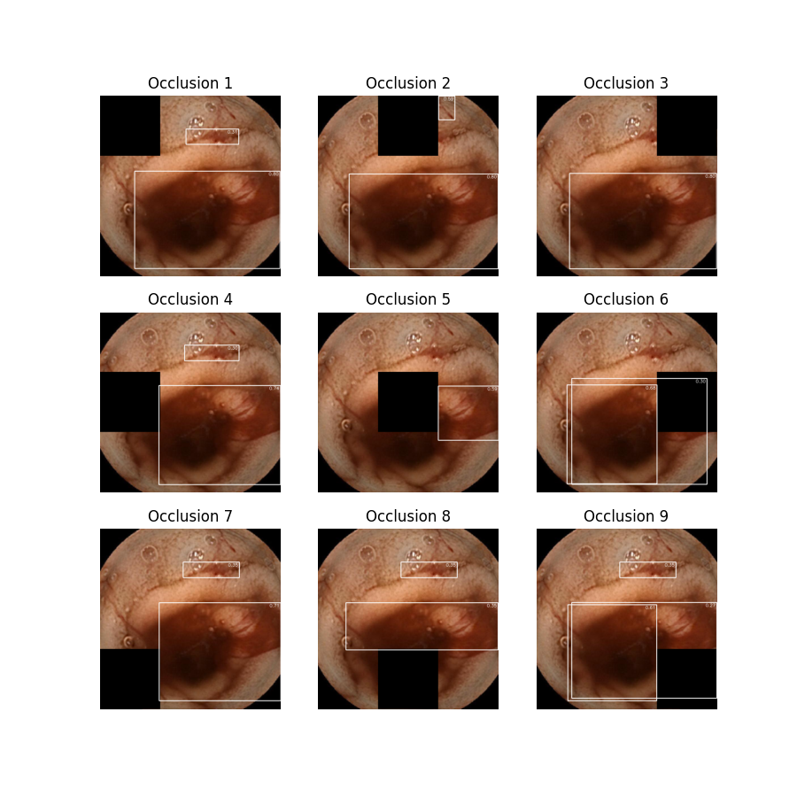

# Auto-WCEBleedGen Challenge Submission [ Team PRIA ]

## Table of Achieved Evaluation Metrics

| Dataset    | Metric                                      | Value                |
| ---------- | ------------------------------------------- | -------------------- |
| Validation | **Classification Accuracy**                 | **96.10%**           |
| Validation | **Classification Recall**                   | **96.10%**           |
| Validation | **Classification F1-Score**                 | **96.10%**           |
| Validation | **Detection Mean Average Precision**        | **76.8%** @ 0.5(IoU) |
| Validation | **Detection Average Precision**             | **76.8%**            |
| Validation | **Detection Intersection over Union (IoU)** | **80.75%**           |

## Pictures of 10 Best Validation Results

### Image 20 (Validation Dataset)


### Image 47 (Validation Dataset)


### Image 54 (Validation Dataset)


### Image 114 (Validation Dataset)


### Image 149 (Validation Dataset)


### Image 157 (Validation Dataset)


### Image 212 (Validation Dataset)


### Image 305 (Validation Dataset)


### Image 314 (Validation Dataset)


### Image 786 (Validation Dataset)


## Interpretability Plots for the 10 Best Validation Results

### Image 20 Occlusion Plot


### Image 47 Occlusion Plot


### Image 54 Occlusion Plot


### Image 114 Occlusion Plot



### Image 149 Occlusion Plot


### Image 157 Occlusion Plot


### Image 212 Occlusion Plot


### Image 305 Occlusion Plot


### Image 314 Occlusion Plot


### Image 786 Occlusion Plot


## Pictures of 5 Best Test Dataset 1 Results

### A0001.png (Dataset 1)


### A0006.png (Dataset 1)


### A0026.png (Dataset 1)


### A0038.png (Dataset 1)


### A0041.png (Dataset 1)


## Pictures of 5 Best Test Dataset 2 Results

### A0060.png (Dataset 2)


### A00129.png (Dataset 2)


### A0134.png (Dataset 2)


### A0145.png (Dataset 2)


### A0285.png (Dataset 2)


## Interpretability Plots for the 5 Best Test Dataset 1 Results

### A00001.png Occlusion Plot (Dataset 1)


### A00006.png Occlusion Plot (Dataset 1)


### A00026.png Occlusion Plot (Dataset 1)


### A00038.png Occlusion Plot (Dataset 1)


### A00041.png Occlusion Plot (Dataset 1)


## Interpretability Plots for the 5 Best Test Dataset 2 Results

### A00060.png Occlusion Plot (Dataset 2)


### A0129.png Occlusion Plot (Dataset 2)


### A0134.png Occlusion Plot (Dataset 2)


### A0145.png Occlusion Plot (Dataset 2)


### A0285.png Occlusion Plot (Dataset 2)


## Link to Datasets and Models:

We Recommend you to explore our dataset and trained models on the [Roboflow Universe platform](https://universe.roboflow.com/wce-fpcql/wce_clean_train_2.0).
It has multiple versions of the dataset, more data has been added and annotated (6345 Images), 6 models have been trained, deployed and evaluated, which can be easily visualized and used!

## Repository Structure

1. [**Model Weights**](#Model_Weights):

   - This directory contains the YOLOv8-X trained model, named **best.pt**, along with any other relevant training data or model-related files. **All the Predictions and Evaluations for classification and Detection are done with this model**.

2. [**Classification Predictions**](Classification_Predictions):

   - Inside this directory, the [**All_Predictions.csv**](Classification_Predictions/All_Predictions.csv) file contains the classification prediction of both test_dataset_1 and 2 from the YOLOv8-X model. Along with it, there are validation predictions and evaluations.

3. [**Code**](Code):

   - This section contains the code for [training](Code/Training.py), [testing](Code/Testing_with_classification.py), and [validation](Code/Validation.py).

4. [**Datasets**](Datasets):

   - The Datasets directory holds our annotated dataset in YOLO format, split into an 80/20 ratio for training and validation (all evaluations are done on this validation data).

5. [**Detection Predictions**](Detection_Predictions):

   - This directory includes predictions of the YOLOv8-X model on the [Validation Dataset](Detection_Predictions/validation/), [Test Dataset 1](Detection_Predictions/test_dataset_1/), and [Test Dataset 2](Detection_Predictions/test_dataset_2/) with the labels.

6. [**Matlab Classification Model**](Matlab_Classification_Model):

   - This directory contains a separate classification model, based on the MobileNet architecture, built using MATLAB. All relevant code and results related to this model are stored here.

7. [**Other Detection Model**](Other_Detection_Model):
   - This directory contains a separate YOLO Detection model, trained on a [dataset](Other_Detection_Model/Dataset/) with annotations extracted from the given binary masks. The Model weights, dataset, and results are stored here and can be viewed in [Roboflow](https://app.roboflow.com/pavan-cs-q3hq0/wce_org/). **This is not the best model, just another model trained with different dataset annotations(sticking to the original training dataset and experts binary masks). The First model(YOLOv8-X) can generalize and perform better as it has been trained on more data and gone through more iterations**.

## YOLOv8-X Detection and Classification Model!

We have trained a YOLOv8-X model, specifically designed to identify bleeding regions in Wireless capsule endoscopy (WCE) images. This model is used for **both Detection and classification** problems. By default it does Detection, and whenever we get detections (bounding boxes), we automatically classify the frames as bleeding, or else non-bleeding. Please Visit [Testing_with_classification.py](Code/Testing_with_classification.py) and Model_Weights files to use it.

## How to Run

### Prerequisites

Before you begin, ensure you have the following prerequisites installed on your system:

- [Python](https://www.python.org/downloads/) (Python 3.x)
- [PyTorch](https://pytorch.org/get-started/locally/)
- [OpenCV-Python](https://pypi.org/project/opencv-python/)
- [Ultralytics](https://pypi.org/project/ultralytics/)

You can install the required Python packages (PyTorch, OpenCV-Python, Ultralytics) using pip:

```
pip install torch opencv-python ultralytics
```

### Training:

To train the model, just download the weights(**Model_weights/best.pt**) and [wce_dataset](Datasets), then run the [training script](Code/Training.py) or [training_notebook](Code/training_notebook.ipynb) or Command below:

```
yolo task=detect mode=train model=/path/to/your/model.pt data=/path/to/your/data.yaml epochs=50 imgsz=800 plots=True
```

The above command will train the YOLOv8 model for given epochs and save the best model weights in the weights folder. The training results will be saved in the runs/train folder.The [original YOLOv8](https://github.com/ultralytics/ultralytics) models can be downloaded from [here](https://github.com/ultralytics/assets/releases/download/v0.0.0/yolov8s.pt)!

### Testing/Prediction:

To predict on data, run [Testing_with_classification.py](Code/Testing_with_classification.py) script for getting both detection and classification results or [Testing.py](Code/Testing.py) for only detection. In both the scripts, in the end give the path to model weights, input folder, output folder and the predictions will be stored.
Or through command line:

```
yolo task=detect mode=predict model=/path/to/your/model.pt data=/path/to/your/data.yaml source=/path/to/your/images_or_video_or_folder save=True conf=0.25
```

The above command will run YOLOv8 inference on the images or video or folder and save the results in the runs/detect/predict folder.

### Validation:

To validate the model, run the [validation script](Code/Validation.py) or Command below:

```
yolo task=detect mode=val model=/path/to/your/model.pt data=/path/to/your/data.yaml
```

The above command will run YOLOv8 validation on the validation dataset and save the results in the runs/detect/val folder.

## Conclusion

We have trained the YOLOv8-X Model.The first five folder in the repository-[Model_Weights](#Model_Weights),[Classification_Predictions](Classification_Predictions),[Code](Code),[Datasets](Datasets),[Detection_Predictions](Detection_Predictions) are from this model.Both the Classification and Detection tasks, along with all the evaluations are done with this model on the [Validation dataset](Datasets/wce_dataset/valid/).
There was some problem with the bounding box annotations in the training data given,there were many wrong,less accurate and missed annotations. So we reannotated the dataset,and added more data from other internet sources, annotated them too and trained this Model.

The sixth folder [Matlab_Classification_Model](Matlab_Classification_Model), contains a seperate Classification model with all the related folders.

The seventh folder [Other_Detection_Model](Other_Detection_Model), is also a seperate Detection model.
As I mentioned above due to the data problem, We created a seperate version of the dataset, by reannotating it completely from binary masks and trained this Model.Please take a look at it if you want to see how the model performs, when trained just on the training dataset.

**So, the first YOLOv8-X Model is the best Model so far, for both Detection and Classification.It has been trained on more data (6345 Images) and gone through several iterations!**

## Future Work

- **Enhanced Dataset**: We can create a larger, diverse dataset, with good quality annotations by collaborating with medical professionals.

- **Model Exploration**: We can experiment with different model architectures, including larger models, and maybe go forward and develop segmentation models, which can potentially be more accurate and useful for medical purposes!
